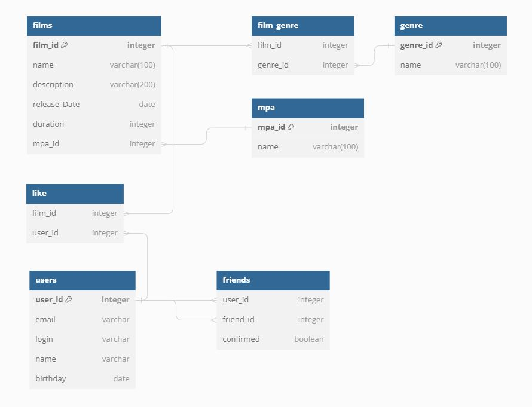

# java-filmorate
Template repository for Filmorate project.

## ER-diagram

## Описание диаграммы
 Users
 Содержит данные о пользователях
 Таблица включает такие поля:
*    user_id (первичный ключ) - идентификатор пользователя
*    login - логин пользователя
*    email - email пользователя
*    name - имя пользователя
*    birthday - день рождения пользователя

 Films
 Содержит данные о фильмах
 Таблица включает такие поля:
*    film_id (первичный ключ) - идентификатор фильма
*    name - название фильма
*    description - описание фильма
*    release_date - дата выхода фильма
*    duration - продолжительность фильма
*    mpa_id (внешний ключ mpa.mpa_id) - идентификатор рейтинга MPA 

 Like
 Содержит данные о реакциях пользователей к фильму
 Таблица включает поля:
*    film_id (внешний ключ films.film_id) - идентификатор фильма 
*    user_id (внешний ключ users.user_id) - идентификатор пользователя, поставившего лайк фильму 

 Friends
 Содержит данные о друзьях пользователей
 Таблица включает поля:
*    user_id (внешний ключ users.user_id) - идентификатор пользователя 
*    friend_id (внешний ключ users.user_id) - идентификатор друга пользователя (внешний ключ users.user_id)
*    confirmed - статус подтвеждения запроса на дружбу

 Genre
 Содержит данные о жанрах фильмов
 Таблица включает поля:
*    genre_id (первичный ключ) - идентификатор жанра
*    name - название жанра

 Mpa
 Содержит данные о рейтингах MPA, определяющих возрастное ограничение
 Таблица включает поля:
*    mpa_id (первичный ключ) - идентификатор рейтинга
*    name - название рейтинга (*рейтинг международной ассоциации MPA, который характеризует доступность просмотра фильма для детей)
* - G - у фильма нет возрастных ограничений
* - PG — детям рекомендуется смотреть фильм с родителями
* - PG-13 — детям до 13 лет просмотр не желателен
* - R — лицам до 17 лет просматривать фильм можно только в присутствии взрослого
* - NC-17 — лицам до 18 лет просмотр запрещён

 Film_genre
 Содержит информацию к каким жанрам относится фильм
 Таблица включает поля:
*    film_id (внешний ключ films.film_id) - идентификатор фильма 
*    genre_id (внешний ключ genres.genre_id) - идентификатор жанра 
